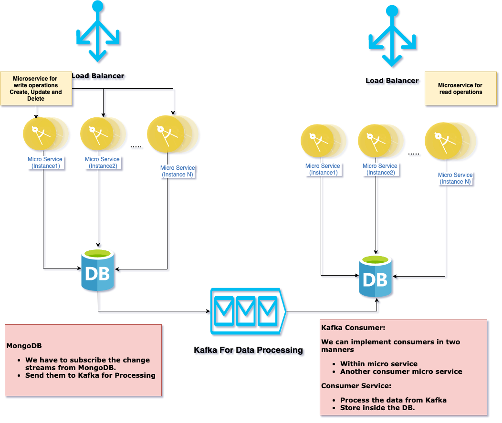

# PayPay Coding Challenge

<ol>
<li> Coding task: 

Please refer `CustomQueueImpl.java`

</li>

<li> Design Question: Design A Google Analytic like Backend System. We need to provide Google Analytic like services to our customers. Pls provide a high level solution design for the backend system. Feel free to choose any open source tools as you want. 
 
 All microservice are spring-boot microservice,it includes cloud functionality,metrices and other been maintain by it. 
 

</li>
